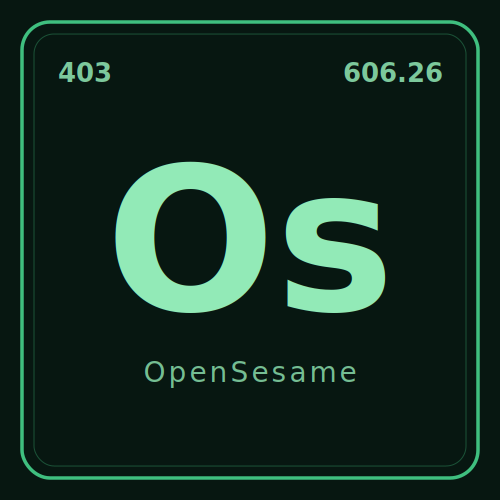

<p align="center">
  <a href="https://github.com/CascadingLabs/OpenSesame">
    <picture>
      <source media="(prefers-color-scheme: dark)" srcset="media/logo-dark.svg">
      <source media="(prefers-color-scheme: light)" srcset="media/logo-light.svg">
      
    </picture>
  </a>
</p>

<p align="center">
  <a href="https://discord.gg/UnqRNzFYjM"></a>
  <a href="https://opensource.org/licenses/Apache-2.0"></a>
</p>

# OpenSesame

Async-native self-hosted captcha/token-solving microservice with no paid
solver APIs.

> [!WARNING]
> OpenSesame is research tooling for API design and web reverse engineering. **You assume all legal risk for how you use it.** Respect `robots.txt`, rate limits, and IP bans; and please don't bypass them with Tor or a VPN. Read [DISCLAIMER.md](DISCLAIMER.md) before pointing it at anything.

## Usage

OCR fast-path smoke:

```bash
PYTHONPATH=src python - <<'PY'
from open_sesame.solvers.ocr import normalize_ocr_text

print(normalize_ocr_text(" A8 b-2 "))
PY
```

## Development

```bash
PYTHONPATH=src python -m pytest
```

The first OCR slice tracks `CAS-170`: normal distorted-text captchas where the
answer is the text in the image. The current implementation provides the
Tesseract fast-path contract and target registry; CRNN training is a later
slice.

Live 2Captcha smoke:

```bash
PYTHONPATH=src python examples/live_2captcha_normal.py --mode oracle
PYTHONPATH=src /home/andrew/Desktop/cl/VoidCrawl/.venv/bin/python examples/live_2captcha_normal.py --mode ocr --solver local-ml --model grafj-crnn-base --cache-dir .local/hf --local-files-only --allow-remote-code --ml-python python
```

The live harness uses `VoidCrawl` for stealth browser/session work and `httpx`
for async HTTP fetches.

Local downloadable OCR models:

```bash
PYTHONPATH=src python examples/local_ocr_model.py --list
PYTHONPATH=src python examples/local_ocr_model.py --model grafj-crnn-base --cache-dir .local/hf --allow-remote-code --download
PYTHONPATH=src python examples/benchmark_ocr_model.py /tmp/opensesame-2captcha-sample.jpg --model grafj-crnn-base --cache-dir .local/hf --allow-remote-code --json
PYTHONPATH=src python examples/live_2captcha_ocr_fetch.py --model grafj-crnn-base --cache-dir .local/hf --local-files-only --allow-remote-code
```

Benchmark output includes model load time, first inference time, warm latency,
RSS memory, CPU load, and GPU metrics when the selected device resolves to a GPU.
The Graf-J models use pinned Hugging Face revisions with custom model code, so
local execution requires explicit `--allow-remote-code`.

For AMD Radeon iGPU acceleration notes, see
[docs/rocm-radeon-igpu-spike.md](docs/rocm-radeon-igpu-spike.md). The ROCm
path is a spike for speeding up stronger local OCR and image-classification
models; it does not change OpenSesame's browser/session-bound token model.
ROCm PyTorch exposes AMD GPUs through the `torch.cuda` API, so OpenSesame's
`--device auto` mode will report `device=cuda:0` and `accelerator=rocm` when a
ROCm build is visible.

Labeled corpus eval:

```bash
PYTHONPATH=src python examples/eval_ocr_corpus.py path/to/corpus.jsonl --solver local-ml --model grafj-crnn-base --cache-dir .local/hf --local-files-only --allow-remote-code --json
```

Image classification experiments:

```bash
PYTHONPATH=src python examples/classify_image.py image.jpg --labels "bus,crosswalk,traffic light" --model openai/clip-vit-base-patch32
PYTHONPATH=src python examples/classify_image_grid.py grid.jpg --rows 3 --cols 3 --labels "bus,crosswalk,traffic light"
PYTHONPATH=src python examples/classify_image_grid.py grid.jpg --rows 3 --cols 3 --labels "bus,crosswalk,traffic light" --model openai/clip-vit-large-patch14 --device auto --cache-dir .local/hf
```

Fortress anti-bot throughput probe:

```bash
PYTHONPATH=src python examples/throughput_fortress.py --attempts 25 --concurrency 5
PYTHONPATH=src python examples/fortress_gauntlet.py --engine httpx --max-pages 10 --json
PYTHONPATH=src:/home/andrew/Desktop/cl/VoidCrawl /home/andrew/Desktop/cl/VoidCrawl/.venv/bin/python examples/fortress_gauntlet.py --engine voidcrawl-profile --profile-dir .local/fortress-profile --screenshot-dir .local/fortress-shots --max-pages 10 --attempts 3 --json
PYTHONPATH=/home/andrew/Desktop/cl/OpenSesame/src:/home/andrew/Desktop/cl/Yosoi uv run python /home/andrew/Desktop/cl/OpenSesame/examples/fortress_gauntlet.py --engine yosoi-auto --yosoi-path /home/andrew/Desktop/cl/Yosoi --json
```

The VoidCrawl profile engine runs a single persistent headful Chrome profile by
default. It records Turnstile evidence such as `data-sitekey`, iframe-derived
sitekey, action/cdata, token presence/length, detected captcha kind, and
screenshots when requested. Sitekey is enough to feed a future token-provider
adapter, but OpenSesame still treats browser clearance as a separate outcome.

Google Search reCAPTCHA probe:

```bash
PYTHONPATH=src /home/andrew/Desktop/cl/VoidCrawl/.venv/bin/python examples/google_search_recaptcha_probe.py "weather new york" "site:example.com captcha test" --json
PYTHONPATH=src:/home/andrew/Desktop/cl/VoidCrawl /home/andrew/Desktop/cl/VoidCrawl/.venv/bin/python examples/google_recaptcha_v2_actor.py "weather new york"
PYTHONPATH=src python examples/replay_recaptcha_failures.py --no-replay
PYTHONPATH=src python examples/replay_recaptcha_failures.py --local-files-only --ml-python python
PYTHONPATH=src python examples/replay_recaptcha_failures.py --models openai/clip-vit-large-patch14 --device auto --cache-dir .local/hf --ml-python python
PYTHONPATH=src python examples/replay_recaptcha_failures.py --augmentations helpful --models openai/clip-vit-large-patch14 --device auto --cache-dir .local/hf --ml-python python
```

This runs headless VoidCrawl searches and records whether Google served normal
results, a consent wall, or a `/sorry/` reCAPTCHA/unusual-traffic wall. It is
telemetry for the anti-bot harness; it does not mint or fake
`g-recaptcha-response` tokens. The actor script then drives the visible
reCAPTCHA v2 anchor with CDP mouse events, records token/pass state, and can
crop a visual challenge screenshot for local CPU tile classification. Failed
actor attempts are persisted under `.local/recaptcha-runs`; the replay helper
exports those failures into `.local/recaptcha-failures/corpus.jsonl` so saved
challenge crops can be replayed locally against improving CLIP/vision models.
Use `--device auto` for ROCm/CUDA-capable PyTorch environments. Use
`--augmentations helpful` to score each active tile through identity, contrast,
sharpness, brightness, and center-zoom variants; each variant is recorded as a
separate ensemble vote with augmentation metadata for audit and calibration.

Tile selection on adversarial (noised) grids is bottlenecked by classifier
**recall**, not click accuracy. Two evidence-backed boosters sit on the
contrastive `target` vs `not-target` vote path:

- `--prompt-ensemble` averages each CLIP score across a bank of prompt
  templates (`DEFAULT_HYPOTHESIS_TEMPLATES`). On a measured 2captcha v2-enterprise
  grid this lifted true-bus recall from 1/3 to 2/3 at **100% precision** (no
  distractor inflation) — the largest clean win.
- `--augmentations denoise` adds median-filtered tile variants. Median passes
  recover 3-4x of the score the noise strips from weak true tiles, but each
  variant is a separate vote: with the default `--min-consensus 1.0` they make
  the decision *stricter* (all must agree), so denoise is a recovery lever that
  wants `--min-consensus 0.5` (majority) to help rather than gate.

A residual miss (a distant/occluded object CLIP-base reads as another class)
is a model-capability ceiling, not a tuning gap. The fix is a model trained on
the reCAPTCHA tile distribution: with `--models verytuffcat/recaptcha
--classifier-task image-classification`, a supervised 13-class ViT cleared the
same grid **3/3 with zero false positives at 0.999 confidence**, including the
tile CLIP-base could not recover at any threshold. Candidate labels and prompt
templates are ignored in this mode (the model has a fixed head); its `other`
class is the native contrastive negative. See
[docs/recaptcha-vision-models.md](docs/recaptcha-vision-models.md) for the model
and dataset comparison. When even the supervised model is uncertain, the path
is noVNC (CAS-175).

The actor reads Google's prompt to classify the challenge variant
(`parse_recaptcha_challenge_type`) and adapts the click loop:

- **`dynamic`** ("click verify once there are none left"): after each click
  it waits for the faded-in replacement tiles to stop animating
  (`wait_for_recaptcha_tiles_stable` — two identical consecutive crops), then
  re-classifies the refilled grid, and only presses verify once a round plans
  zero clicks. This is the 2captcha v2-enterprise demo's variant.
- **`skip` / `one_shot`**: single-pass 3x3/4x4 grids, verified once.

When a verify press yields no token but the widget stays up, Google has
chained a new challenge: the actor re-reads the frame, re-OCRs the prompt for
the new target label, and continues up to `--max-challenges`. Each challenge's
prompt crop and per-round tile plans are persisted for review.

```bash
# zero-shot CLIP with recall boosters
PYTHONPATH=src /home/andrew/Desktop/cl/VoidCrawl/.venv/bin/python examples/google_recaptcha_v2_actor.py --url https://2captcha.com/demo/recaptcha-v2-enterprise --challenge-mode image --ml-python .local/venvs/rocm/bin/python --device auto --max-rounds 6 --max-challenges 4 --prompt-ensemble --augmentations denoise --min-consensus 0.5
# supervised reCAPTCHA ViT (highest recall on noised tiles)
PYTHONPATH=src /home/andrew/Desktop/cl/VoidCrawl/.venv/bin/python examples/google_recaptcha_v2_actor.py --url https://2captcha.com/demo/recaptcha-v2-enterprise --challenge-mode image --ml-python .local/venvs/rocm/bin/python --device auto --max-rounds 6 --max-challenges 4 --models verytuffcat/recaptcha --classifier-task image-classification
```

reCAPTCHA audio side-door research (CAS-178):

```bash
PYTHONPATH=src /home/andrew/Desktop/cl/VoidCrawl/.venv/bin/python examples/google_recaptcha_v2_actor.py --url https://www.google.com/recaptcha/api2/demo --challenge-mode audio
PYTHONPATH=src .local/venvs/rocm/bin/python examples/dictate_recaptcha_audio.py .local/recaptcha/audio-downloads/<challenge>.mp3 --model openai/whisper-tiny.en
```

Audio mode switches the open challenge to Google's audio variant, captures a
screenshot, and tries to download the challenge MP3 into
`.local/recaptcha/audio-downloads`. Per CAS-178, the run reports
**block-rate separately from transcription accuracy**: when Google answers
with the "Try again later / automated queries" wall the attempt is marked
`audio-rate-limited` (detected via AX tree plus screenshot OCR, since the
challenge iframe is invisible to the page-level AX tree) and the download is
skipped. Rate-limit mitigation is VoidCrawl proxy/profile rotation, not the
solver. The dictation helper transcribes any downloaded clip with a local
Whisper model (`ml-audio` extra; needs `ffmpeg`).

## Test targets

See [docs/ocr-test-sites.md](docs/ocr-test-sites.md) for live held-out targets
and self-hosted/synthetic sources. See
[docs/throughput-targets.md](docs/throughput-targets.md) for anti-bot routing
throughput targets.

## Related projects

| Project        | Repo                                                                     |
|----------------|--------------------------------------------------------------------------|
| Cascading Labs | [github.com/CascadingLabs](https://github.com/CascadingLabs)             |
| Assets         | [github.com/CascadingLabs/Assets](https://github.com/CascadingLabs/Assets) |
| VoidCrawl      | [github.com/CascadingLabs/VoidCrawl](https://github.com/CascadingLabs/VoidCrawl) |
| Yosoi          | [github.com/CascadingLabs/Yosoi](https://github.com/CascadingLabs/Yosoi) |

## Community

- **Discord:** [discord.gg/UnqRNzFYjM](https://discord.gg/UnqRNzFYjM)
- **Support:** see [SUPPORT.md](SUPPORT.md)
- **Security:** see [SECURITY.md](SECURITY.md)
- **Code of Conduct:** see [CODE_OF_CONDUCT.md](CODE_OF_CONDUCT.md)
- **Responsible use:** see [DISCLAIMER.md](DISCLAIMER.md)

## Contact

[contact@cascadinglabs.com](mailto:contact@cascadinglabs.com)

## License

Apache 2.0 — see [LICENSE](LICENSE).
