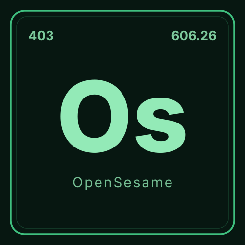

<p align="center">
  <a href="https://github.com/CascadingLabs/OpenSesame">
    <picture>
      <source media="(prefers-color-scheme: dark)" srcset="media/logo-dark.svg">
      <source media="(prefers-color-scheme: light)" srcset="media/logo-light.svg">
      
    </picture>
  </a>
</p>

<p align="center">
  <a href="https://discord.gg/c8MKEaWEEK"></a>
  <a href="https://opensource.org/licenses/Apache-2.0"></a>
</p>

# OpenSesame

Self-hosted captcha/token-solving microservice with no paid solver APIs.

## Disclaimer & Responsible Use

[DISCLAIMER.md](DISCLAIMER.md)

## Usage

OpenSesame currently ships a local human-takeover control center for live
VoidCrawl challenge sessions.

```bash
uv run opensesame serve
# or open the browser automatically
uv run opensesame watch
```

The operator UI listens on `http://127.0.0.1:8765` by default and stores event
metadata in async SQLite at `.opensesame/opensesame.sqlite3`.

Create a takeover event from a VoidCrawl `capture_challenge` payload:

```bash
curl -X POST http://127.0.0.1:8765/api/takeovers \
  -H 'content-type: application/json' \
  -d '{"session_id":"demo","event_id":"demo-1","captcha_kind":"turnstile","handoff_url":"http://127.0.0.1:3069","remote_browser_url":"http://127.0.0.1:3069"}'
```

Use the generic `handoff_url` / `remote_browser_url` fields for the
VoidCrawl browser appliance or any other live remote-browser handoff. Legacy
backend-specific fields remain accepted for older VoidCrawl sessions.

Chrome/Chromium is the most reliable local operator browser for the embedded
OpenSesame/Neko WebRTC view. Firefox, Zen, and Safari can use the same
OpenSesame web app;
if the embedded iframe cannot connect or keep keyboard/clipboard focus, click the
detached **Open remote browser** link, which controls the same remote session.
Clipboard-manager workflows are expected: select the desired host clipboard entry,
click the target field inside the remote Chrome session, then paste with
`Ctrl`/`Cmd`+`V`; the paste action syncs that clipboard entry into the remote
session. OpenSesame stores only event metadata, not clipboard contents. For a clean
Chromium test profile:

```bash
chromium --user-data-dir=/tmp/opensesame-operator --disable-extensions \
  http://127.0.0.1:8765/#events
```

OpenSesame also accepts the shared `interrupt.v1` envelope used by Yosoi and
VoidCrawl:

```bash
curl -X POST http://127.0.0.1:8765/api/interrupts \
  -H 'content-type: application/json' \
  --data-binary @docs/fixtures/interrupts/voidcrawl-captcha.json
```

Runnable handoff examples:

```bash
uv run python examples/oauth_handoff.py
uv run --script examples/yosoi_voidcrawl_latest_interrupt.py --demo-interrupt
uv run --script examples/browser_local_handoff.py
uv run --script examples/live_login_handoff.py
```

## Local browser appliance

For a copy-paste runtime checklist, see [`docs/runtime.md`](docs/runtime.md).

VoidCrawl owns the local browser substrate used by OpenSesame handoffs. It is a
small Neko + Chromium image, not a vendored browser-image fork:

```bash
../VoidCrawl/docker/run-browser.sh
```

Default endpoints:

- Neko live view / `handoff_url`: `http://127.0.0.1:3069`
- Chromium CDP: `http://127.0.0.1:19222/json/version`
- Local browser API: `http://127.0.0.1:3060/health`
- Endpoint contract: `../VoidCrawl/.voidcrawl/browser/browser.json`

The VoidCrawl image exposes CDP for VoidCrawl/Yosoi automation and injects a small
OpenSesame-compatible shell into the Neko client. The shell auto-connects, hides the stock
Neko chrome/menus, and leaves only the remote Chromium viewport and transparent
input overlay. Paste is event-driven: the browser appliance writes the selected
host clipboard text into the remote X clipboard, then sends the remote paste
keystroke. OpenSesame itself stores handoff/event metadata only; it does not
store credential values or clipboard contents.

## Local multimodal host

The automated path starts as a local-only multimodal planner host. Solver engines
keep control of the browser and clicks; the host only returns typed decisions
such as which reCAPTCHA grid tiles to select or whether to verify, refresh, or
escalate.

```bash
# Pydantic AI v2 model
uv run opensesame multimodal serve --port 8787 --model <pydantic-ai-v2-model>

# OpenAI-compatible localhost chat-completions/VLM server
uv run opensesame multimodal serve \
  --port 8787 \
  --model local-vlm \
  --completions-url localhost://12345
```

`localhost://12345` expands to
`http://127.0.0.1:12345/v1/chat/completions` and sends image payloads as
`data:image/...;base64,...` chat-completions image parts.

Useful endpoints:

- `GET /health`
- `GET /capabilities`
- `POST /v1/recaptcha/grid/select`
- `POST /v1/challenges/next-action`

If no model is configured, requests fail closed as `escalate` instead of guessing.

Drive a real local demo with VoidCrawl:

```bash
# terminal 1: operator UI
uv run opensesame serve

# terminal 2: self-hosted VoidCrawl browser appliance
../VoidCrawl/docker/run-browser.sh

# terminal 3: launch VoidCrawl to a demo site, send interrupt to OpenSesame,
# and wait for the UI resolution button
uv run opensesame demo cloudflare turnstile
uv run opensesame demo cloudflare managed
uv run opensesame demo recaptcha v2
uv run opensesame demo recaptcha v3-enterprise
```

Use `--all`/`-A` on the family commands to queue a focused stress-test set:

```bash
uv run opensesame demo cloudflare -A
uv run opensesame demo recaptcha -A
```

DataDome intentionally has no demo target yet; `opensesame demo datadome` reports
that it needs an owned or respectful fixture before it joins the MPP demo set.

Then open the operator UI, solve the challenge in the embedded OpenSesame remote
browser or detached remote-browser tab, and press **Mark resolved** in OpenSesame:

```bash
chromium --user-data-dir=/tmp/opensesame-operator --disable-extensions \
  http://127.0.0.1:8765/#events
```

The demo command re-probes the same VoidCrawl tab and prints whether the captcha
is gone.

For the MTCaptcha HITL resume example:

```bash
# terminal 1, from this repo
../VoidCrawl/docker/run-browser.sh

# terminal 2, from this repo
uv run python examples/mtcaptcha_resume.py --open-ui
# equivalent CLI path:
uv run opensesame demo mtcaptcha --open-ui
```

This sends the same VoidCrawl tab to OpenSesame, lets a human clear the
MTCaptcha challenge in the OpenSesame remote browser, then resumes automation
and re-probes the page.

To queue the focused MPP demo set, reCAPTCHA plus Cloudflare, as pending work for
frontend stress testing without solving any of them:

```bash
# terminal 1, from this repo
../VoidCrawl/docker/run-browser.sh

# terminal 2, from this repo
uv run opensesame demo all
```

`all` opens concurrent tabs in one VoidCrawl browser session, queues the
resulting browser states in OpenSesame, and does not auto-open the dashboard.
Open `http://127.0.0.1:8765` yourself when ready. Use Ctrl-C when done or pass
`--exit-after-all` if an existing UI is already up. Extraneous capture families
remain available through `opensesame demo run <target>` for ad hoc testing.

## Development

```bash
uv sync
uv run pytest
```

## Related projects

| Project        | Repo                                                                     |
|----------------|--------------------------------------------------------------------------|
| Cascading Labs | [github.com/CascadingLabs](https://github.com/CascadingLabs)             |
| Assets         | [github.com/CascadingLabs/Assets](https://github.com/CascadingLabs/Assets) |
| VoidCrawl      | [github.com/CascadingLabs/VoidCrawl](https://github.com/CascadingLabs/VoidCrawl) |
| Yosoi          | [github.com/CascadingLabs/Yosoi](https://github.com/CascadingLabs/Yosoi) |

## Community

- **Discord:** [discord.gg/c8MKEaWEEK](https://discord.gg/c8MKEaWEEK)
- **Support:** see [SUPPORT.md](SUPPORT.md)
- **Security:** see [SECURITY.md](SECURITY.md)
- **Code of Conduct:** see [CODE_OF_CONDUCT.md](CODE_OF_CONDUCT.md)

## Contact

[contact@cascadinglabs.com](mailto:contact@cascadinglabs.com)

## License

Apache 2.0 — see [LICENSE](LICENSE).
